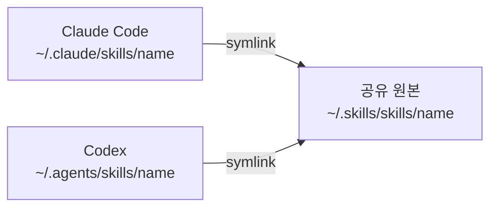

# my-agents-skills

> Claude Code와 Codex에서 공유하는 재사용 스킬 49개. 설계·구현·검토·문서화·콘텐츠 제작 절차를 담으며, 어느 도구에서든 같은 방식으로 invoke됩니다.

  

## 공유 구조

`skills/`가 공유 원본입니다. Claude Code와 Codex 양쪽이 심볼릭 링크로 같은 원본을 읽습니다.



- `~/.skills/` — 이 저장소의 로컬 체크아웃
- `~/.claude/skills/` — Claude Code 탐색 경로 (개인 설정 저장소 [`claude-config`](https://github.com/Je-hye/claude-config)와 별도)
- `~/.agents/skills/` — Codex 탐색 경로. 직접 설치된 외부 스킬도 있으므로 디렉터리 전체를 교체하지 않습니다

링크가 같은 원본을 가리키면 원본 수정이 양쪽에 즉시 반영됩니다.

## 사용법

| Claude Code | Codex |
|-------------|-------|
| `/logic-review` | `$logic-review` |
| `/pre-mortem` | `$pre-mortem` |
| `/hackathon-mode` | `$hackathon-mode` |
| `/test-driven-development` | `$test-driven-development` |

스킬이 목록에 없으면 링크 대상의 `SKILL.md`가 존재하는지 확인합니다. 도구별 MCP·로컬 프로그램 의존성이 있는 스킬은 해당 환경도 별도로 준비해야 합니다.

## Skills

### 설계·계획 (7)

| 스킬 | 설명 | 언제 |
|------|------|------|
| `hackathon-mode` | demo-first 모드 전환, 정식 루틴 일시 정지 | 마감 있는 빌드 시작 시 |
| `hackathon-task-planner` | MVP 태스크 분해 + 크리티컬 패스 | 해커톤 계획 단계 |
| `idea-refine` | 막연한 아이디어 → 검증 가능한 컨셉 | 아이디어가 불분명할 때 |
| `incremental-implementation` | 점진적 기능 추가, 단계별 검증 | 다단계 기능 구현 시 |
| `interview-me` | 1문 1답으로 실제 의도 추출 | 요구사항이 불분명할 때 |
| `planning-and-task-breakdown` | 스펙 → 구현 가능한 태스크 목록 | 태스크 분해가 필요할 때 |
| `spec-driven-development` | 스펙 문서 기반 개발 | 코드 전에 스펙부터 |

### 구현·도메인 (10)

| 스킬 | 설명 | 언제 |
|------|------|------|
| `api-and-interface-design` | 안정적인 API·모듈 경계 설계 | API·공개 인터페이스 설계 시 |
| `ci-cd-and-automation` | CI/CD 파이프라인 구성·수정 | 빌드·배포 자동화 시 |
| `claude-api` | Anthropic SDK / Claude API 개발·디버깅 | `anthropic` import 프로젝트 |
| `deprecation-and-migration` | 지원 종료 및 마이그레이션 관리 | 기존 시스템 교체 시 |
| `fastapi-expert` | FastAPI + Pydantic V2 백엔드 | FastAPI 작업 시 |
| `frontend-ui-engineering` | 프로덕션급 UI 컴포넌트·레이아웃 | 프론트엔드 구현 시 |
| `oauth` | OAuth redirect URI·로컬 개발 설정 | OAuth 연동 오류 시 |
| `performance-optimization` | 병목 탐지 및 성능 개선 | 성능 저하·요구사항 있을 때 |
| `security-and-hardening` | 취약점 방어 및 보안 강화 | 사용자 입력·인증·외부 연동 시 |
| `source-driven-development` | 공식 소스 기반, 출처 있는 구현 | 라이브러리 정확성이 중요할 때 |

### 디버깅·리뷰 (7)

| 스킬 | 설명 | 언제 |
|------|------|------|
| `adversarial-reviewer` | 반대 관점으로 코드 검토 | PR 병합 전 |
| `code-review-and-quality` | 다축 코드 품질 점검 | 코드 리뷰 시 |
| `code-simplification` | 동작 유지하며 복잡도 제거 | 코드가 과하게 복잡할 때 |
| `debugging-and-error-recovery` | 근본 원인 찾기 | 테스트 실패·예상 외 동작 시 |
| `doubt-driven-development` | 비독립적 리뷰로 자기 확신 검증 | 정확성이 중요한 결정 전 |
| `logic-review` | 내부 일관성·숨은 가정 검증 | 설계·계획 논리 점검 시 |
| `paper-review` | AI/ML/CV 논문 체계적 분석 | 논문 리뷰 시 |

### 테스트·검증 (2)

| 스킬 | 설명 | 언제 |
|------|------|------|
| `browser-testing-with-devtools` | Chrome DevTools MCP로 실 브라우저 테스트 | DOM·콘솔·네트워크 검사 시 |
| `test-driven-development` | 테스트 선행 개발 | 로직 구현·버그 수정 시 |

### Git·배포 (2)

| 스킬 | 설명 | 언제 |
|------|------|------|
| `git-workflow-and-versioning` | 커밋·브랜치·충돌 해결 | 모든 코드 변경 시 |
| `shipping-and-launch` | 프로덕션 출시 체크리스트·롤백 | 배포 직전 |

### 문서·보고 (7)

| 스킬 | 설명 | 언제 |
|------|------|------|
| `brief` | 세션 중간 상태 요약 | 기능 완료·방향 전환 시 |
| `debrief` | 7개 병렬 에이전트로 세션 인사이트 수확 | 세션 종료 시 |
| `session-handoff` | 작업 컨텍스트 이전 준비 | 도구·세션 전환 시 |
| `context-engineering` | 에이전트 컨텍스트 최적화 | 세션 시작·품질 저하 시 |
| `documentation-and-adrs` | 결정 기록 및 문서화 | 아키텍처 결정·기능 출시 시 |
| `korean-polishing` | EunHye 스타일 한국어 퇴고 | 한국어 공식 문서 작성 시 |
| `weekly-report` | 연구실 주간보고서 작성 | 주간 보고 시 |

### 비판적 사고 (3)

| 스킬 | 설명 | 언제 |
|------|------|------|
| `pre-mortem` | 병렬 에이전트로 사전 실패 분석 | 설계 확정 전 |
| `rapid-prototyper` | 최소 동작 프로토타입 즉시 생성 | 빠른 아이디어 검증 시 |
| `the-fool` | 구조적 반론으로 계획·결정 검증 | devil's advocate가 필요할 때 |

### 메타·도구 (2)

| 스킬 | 설명 | 언제 |
|------|------|------|
| `find-skills` | 스킬 탐색 및 설치 안내 | 어떤 스킬을 쓸지 모를 때 |
| `using-agent-skills` | 스킬 탐색 및 실행 메타 스킬 | 세션 시작 시 |

### Confluence·리뷰 대응 (4)

| 스킬 | 설명 | 언제 |
|------|------|------|
| `confluence-batch-review` | 작성자 기준 문서 일괄 수정·댓글 분기 | 여러 문서 일괄 처리 시 |
| `confluence-diff` | 로컬 docs ↔ Confluence 원본 비교 | 문서 drift 의심 시 |
| `confluence-section-patch` | 특정 섹션만 Confluence에 반영 | 부분 업데이트 시 |
| `pr-review-respond` | 문서 차이 관련 PR 리뷰 대응 | reviewer 피드백 처리 시 |

### 개발 자동화·콘텐츠 (4)

| 스킬 | 설명 | 언제 |
|------|------|------|
| `dev-loop` | 스펙 정의부터 PR까지 에이전트 자동 이어받기 | 기능 개발 전 루프 자동화 시 |
| `solve` | 수학 문제 손글씨 풀이 생성 | 로컬 math-handwriting-solver 필요 |
| `ai-content-production-team` | 5개 역할 에이전트로 영상 콘텐츠 숏폼 제작 | 콘텐츠 제작 파이프라인 시 |
| `union-science-blog-team` | 학원 블로그 기획·검수·게시 패키지 | 네이버 블로그 포스팅 시 |

## 설치

```bash
git clone https://github.com/Je-hye/my-agents-skills.git ~/.skills
```

<details>
<summary>심볼릭 링크 설정 (Claude Code + Codex 양쪽 연결)</summary>

다음 명령은 원본별 링크를 두 탐색 경로에 추가합니다. 기존 파일·디렉터리·링크는 덮어쓰지 않고 건너뜁니다.

```bash
mkdir -p "$HOME/.claude/skills" "$HOME/.agents/skills"
for skill_dir in "$HOME/.skills/skills/"*; do
  [ -f "$skill_dir/SKILL.md" ] || continue
  skill_name="${skill_dir##*/}"
  for skill_root in "$HOME/.claude/skills" "$HOME/.agents/skills"; do
    skill_link="$skill_root/$skill_name"
    if [ -e "$skill_link" ] || [ -L "$skill_link" ]; then
      printf '기존 항목 보존: %s\n' "$skill_link"
      continue
    fi
    ln -s "$skill_dir" "$skill_link"
  done
done
```

링크 확인:

```bash
ls -ld ~/.claude/skills/logic-review ~/.agents/skills/logic-review
readlink ~/.agents/skills/logic-review
test -f ~/.agents/skills/logic-review/SKILL.md
```

</details>

## 스킬 구조

각 스킬에는 이름과 설명이 있는 `SKILL.md`가 필요합니다. 추가 자료는 용도에 따라 함께 관리합니다.

```text
skills/<name>/
├── SKILL.md
├── agents/       # 선택: 도구별 메타데이터
├── references/   # 선택: 상세 지침
├── scripts/      # 선택: 실행 코드
└── tests/        # 선택: 검증 코드
```

```markdown
---
name: skill-name
description: 이 스킬이 필요한 작업과 사용 조건
---

# Skill Title

스킬 본문...
```

## 검증

블로그 스킬의 상태 관리·승인 단계·문체 검사 테스트:

```bash
PYTHONDONTWRITEBYTECODE=1 python3 -m unittest discover -s skills/union-science-blog-team/tests -v
```
