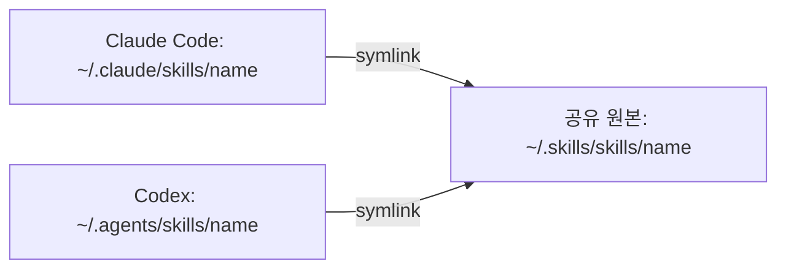

# my-agents-skills

> Claude Code와 Codex에서 공유하는 재사용 스킬 48개. 설계, 구현, 검토, 문서화와 콘텐츠 제작 절차를 담습니다.

  

## 공유 구조

이 저장소의 `skills/`가 공유 스킬 원본입니다. 각 도구의 탐색 경로에서 심볼릭 링크로 같은 원본을 읽습니다.



- `~/.skills/`: 이 공개 저장소의 로컬 체크아웃.
- `~/.claude/skills/`: Claude 스킬 경로. 개인 설정 저장소 `claude-config`와는 별도로 공유 원본을 참조합니다.
- `~/.agents/skills/`: Codex에 노출할 공유 스킬 링크. 이 경로에 직접 설치된 외부 스킬도 있으므로 디렉터리 전체를 교체하지 않습니다.
- `~/.codex/skills/`: 기존 Codex 로컬 스킬이 있을 수 있습니다. 원본을 공유 저장소에 추가하는 것과 기존 설치 경로를 링크로 전환하는 것은 별도 작업입니다.

링크가 같은 원본을 가리키면 원본 수정이 양쪽에 반영됩니다. 도구별 MCP, 서브에이전트, 로컬 프로그램 의존성이 있는 스킬은 해당 환경도 준비해야 합니다.

## Skills

### 설계·계획 (7)

| 스킬 | 설명 |
|------|------|
| `hackathon-mode` | 마감 있는 빌드 — demo-first 모드 전환 |
| `hackathon-task-planner` | MVP 태스크 분해 + 크리티컬 패스 |
| `idea-refine` | 막연한 아이디어 구체화 |
| `incremental-implementation` | 점진적 기능 추가 |
| `interview-me` | 요구사항 인터뷰 |
| `planning-and-task-breakdown` | 태스크 분해 |
| `spec-driven-development` | 스펙 문서 기반 개발 |

### 구현·도메인 (10)

| 스킬 | 설명 |
|------|------|
| `api-and-interface-design` | API 설계 |
| `ci-cd-and-automation` | CI/CD 파이프라인 |
| `claude-api` | Anthropic SDK / Claude API |
| `deprecation-and-migration` | 마이그레이션 |
| `fastapi-expert` | FastAPI 백엔드 |
| `frontend-ui-engineering` | 프론트엔드 UI |
| `oauth` | OAuth 구현 |
| `performance-optimization` | 성능 최적화 |
| `security-and-hardening` | 보안 강화 |
| `source-driven-development` | 라이브러리 소스 기반 개발 |

### 디버깅·리뷰 (7)

| 스킬 | 설명 |
|------|------|
| `adversarial-reviewer` | 반대 관점 코드 검토 |
| `code-review-and-quality` | 코드 품질 점검 |
| `code-simplification` | 코드 단순화 |
| `debugging-and-error-recovery` | 디버깅 및 오류 복구 |
| `doubt-driven-development` | 의심 기반 개발 |
| `logic-review` | 로직 정확성 검토 |
| `paper-review` | 논문 리뷰 |

### 테스트·검증 (2)

| 스킬 | 설명 |
|------|------|
| `browser-testing-with-devtools` | Chrome DevTools MCP 브라우저 테스트 |
| `test-driven-development` | TDD |

### Git·배포 (2)

| 스킬 | 설명 |
|------|------|
| `git-workflow-and-versioning` | Git 워크플로 |
| `shipping-and-launch` | 프로덕션 배포 |

### 문서·보고 (7)

| 스킬 | 설명 |
|------|------|
| `brief` | 세션 브리핑 |
| `debrief` | 세션 종료 분석 |
| `session-handoff` | 다른 세션으로 작업 인계 |
| `context-engineering` | 컨텍스트 엔지니어링 |
| `documentation-and-adrs` | ADR 및 문서 작성 |
| `korean-polishing` | 한국어 공식 문서 퇴고 |
| `weekly-report` | 주간보고서 작성 |

### 비판적 사고 (3)

| 스킬 | 설명 |
|------|------|
| `pre-mortem` | 설계 단계 사전 실패 분석 |
| `rapid-prototyper` | 빠른 프로토타입 생성 |
| `the-fool` | 설계·결정 devil's advocate |

### 메타·도구 (2)

| 스킬 | 설명 |
|------|------|
| `find-skills` | 스킬 탐색 및 설치 안내 |
| `using-agent-skills` | 에이전트 스킬 탐색 및 실행 |

### Confluence·리뷰 대응 (4)

| 스킬 | 설명 |
|------|------|
| `confluence-batch-review` | 작성자에 따른 문서 일괄 수정·댓글 분기 |
| `confluence-diff` | Confluence 원본과 로컬 문서 비교 |
| `confluence-section-patch` | 승인받은 특정 섹션 변경 반영 |
| `pr-review-respond` | 문서 차이에 관한 PR 리뷰 대응 |

### 개발 자동화·콘텐츠 (4)

| 스킬 | 설명 |
|------|------|
| `dev-loop` | 스펙부터 구현·검증·PR까지 개발 절차 |
| `solve` | 로컬 수학 풀이 프로그램 실행 |
| `ai-content-production-team` | 역할별 에이전트로 영상 콘텐츠 제작 준비 |
| `union-science-blog-team` | 학원 블로그 콘텐츠 기획·검수·게시 패키지 제작 |

## 사용법

Claude Code에서는 `/logic-review`, Codex에서는 `$logic-review`처럼 설치된 스킬을 명시해 요청할 수 있습니다. 목록에 나타나지 않으면 링크 대상의 `SKILL.md`가 실제로 존재하는지 확인합니다.

스킬별로 필요한 도구가 다릅니다. Confluence 스킬에는 연결된 MCP가, `solve`에는 로컬 `math-handwriting-solver` 프로젝트가 필요합니다. `dev-loop`의 역할별 에이전트와 참조 스킬도 별도로 준비해야 합니다. 설치만으로 모든 실행 의존성이 제공되지는 않습니다.

## 설치

아래 클론 명령은 `~/.skills`가 없는 새 환경에서 실행합니다. 기존 체크아웃은 로컬 변경을 확인한 뒤 업데이트합니다.

```bash
git clone https://github.com/Je-hye/my-agents-skills.git ~/.skills
```

다음 명령은 원본별 링크를 두 탐색 경로에 추가합니다. 기존 파일·디렉터리·링크는 덮어쓰지 않고 건너뜁니다.

```bash
mkdir -p "$HOME/.claude/skills" "$HOME/.agents/skills"
for skill_dir in "$HOME/.skills/skills/"*; do
  [ -f "$skill_dir/SKILL.md" ] || continue
  skill_name="${skill_dir##*/}"
  for skill_root in "$HOME/.claude/skills" "$HOME/.agents/skills"; do
    skill_link="$skill_root/$skill_name"
    if [ -e "$skill_link" ] || [ -L "$skill_link" ]; then
      printf '기존 항목 보존: %s\n' "$skill_link"
      continue
    fi
    ln -s "$skill_dir" "$skill_link"
  done
done
```

기존 항목이 있는 경우 `readlink`로 대상을 확인하고, 실제 디렉터리라면 내용 차이를 검토한 후 별도로 전환합니다. 위 명령은 끊어진 기존 링크도 자동으로 교체하지 않습니다.

```bash
ls -ld ~/.claude/skills/logic-review ~/.agents/skills/logic-review
readlink ~/.agents/skills/logic-review
test -f ~/.agents/skills/logic-review/SKILL.md
```

## 스킬 구조

각 스킬에는 이름과 설명이 있는 `SKILL.md`가 필요합니다. 추가 자료는 용도에 따라 함께 관리합니다.

```text
skills/<name>/
├── SKILL.md
├── agents/       # 선택: 도구별 메타데이터
├── references/   # 선택: 상세 지침
├── scripts/      # 선택: 실행 코드
└── tests/        # 선택: 검증 코드
```

```markdown
---
name: skill-name
description: 이 스킬이 필요한 작업과 사용 조건
---

# Skill Title

스킬 본문...
```

## 검증

블로그 스킬의 상태 관리·승인 단계·문체 검사 테스트:

```bash
PYTHONDONTWRITEBYTECODE=1 python3 -m unittest discover -s skills/union-science-blog-team/tests -v
```
