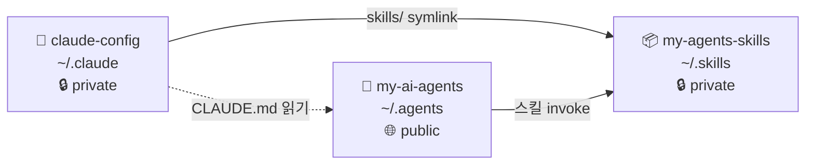

# my-agents-skills

> Claude Code 재사용 스킬 37개 모음. 설계, 구현, 디버깅, 문서화 워크플로를 표준화합니다.

  

## 생태계



### Public vs Private

| 레포 | 가시성 | 이유 |
|------|--------|------|
| `claude-config` | 🔒 Private | 개인 CLAUDE.md 규칙, MCP 서버 설정, 보안 훅 스크립트 포함 |
| `my-agents-skills` | 🔒 Private | 개인 워크플로에 최적화된 스킬 포함, 외부 스킬 라이선스 검토 진행 중 |
| `my-ai-agents` | 🌐 Public | 에이전트 패턴 공유 목적, 개인 식별자는 환경 변수로 분리 |

이 레포는 세 레포 생태계의 스킬 원본 저장소입니다.
- **claude-config**가 `~/.claude/skills/`를 이 레포로 심볼릭 링크
- **my-ai-agents** 에이전트들이 스킬을 invoke

## Skills

### 설계·계획 (7)

| 스킬 | 설명 |
|------|------|
| `hackathon-mode` | 마감 있는 빌드 — demo-first 모드 전환 |
| `hackathon-task-planner` | MVP 태스크 분해 + 크리티컬 패스 |
| `idea-refine` | 막연한 아이디어 구체화 |
| `incremental-implementation` | 점진적 기능 추가 |
| `interview-me` | 요구사항 인터뷰 |
| `planning-and-task-breakdown` | 태스크 분해 |
| `spec-driven-development` | 스펙 문서 기반 개발 |

### 구현·도메인 (10)

| 스킬 | 설명 |
|------|------|
| `api-and-interface-design` | API 설계 |
| `ci-cd-and-automation` | CI/CD 파이프라인 |
| `claude-api` | Anthropic SDK / Claude API |
| `deprecation-and-migration` | 마이그레이션 |
| `fastapi-expert` | FastAPI 백엔드 |
| `frontend-ui-engineering` | 프론트엔드 UI |
| `oauth` | OAuth 구현 |
| `performance-optimization` | 성능 최적화 |
| `security-and-hardening` | 보안 강화 |
| `source-driven-development` | 라이브러리 소스 기반 개발 |

### 디버깅·리뷰 (7)

| 스킬 | 설명 |
|------|------|
| `adversarial-reviewer` | 반대 관점 코드 검토 |
| `code-review-and-quality` | 코드 품질 점검 |
| `code-simplification` | 코드 단순화 |
| `debugging-and-error-recovery` | 디버깅 및 오류 복구 |
| `doubt-driven-development` | 의심 기반 개발 |
| `logic-review` | 로직 정확성 검토 |
| `paper-review` | 논문 리뷰 |

### 테스트·검증 (2)

| 스킬 | 설명 |
|------|------|
| `browser-testing-with-devtools` | Chrome DevTools MCP 브라우저 테스트 |
| `test-driven-development` | TDD |

### Git·배포 (2)

| 스킬 | 설명 |
|------|------|
| `git-workflow-and-versioning` | Git 워크플로 |
| `shipping-and-launch` | 프로덕션 배포 |

### 문서·보고 (4)

| 스킬 | 설명 |
|------|------|
| `context-engineering` | 컨텍스트 엔지니어링 |
| `documentation-and-adrs` | ADR 및 문서 작성 |
| `korean-polishing` | 한국어 공식 문서 퇴고 |
| `weekly-report` | 주간보고서 작성 |

### 비판적 사고 (3)

| 스킬 | 설명 |
|------|------|
| `pre-mortem` | 설계 단계 사전 실패 분석 |
| `rapid-prototyper` | 빠른 프로토타입 생성 |
| `the-fool` | 설계·결정 devil's advocate |

### 메타·도구 (2)

| 스킬 | 설명 |
|------|------|
| `find-skills` | 스킬 탐색 및 설치 안내 |
| `using-agent-skills` | 에이전트 스킬 탐색 및 실행 |

## 사용법

Claude Code에서 `Skill` 도구로 invoke합니다:

```
Skill("hackathon-mode")
Skill("superpowers:brainstorming")
```

`CLAUDE.md`에 스킬 라우팅 테이블을 작성해두면 상황에 맞는 스킬을 자동으로 선택합니다.

## 설치

```bash
# 1. my-agents-skills 클론
git clone https://github.com/Je-hye/my-agents-skills.git ~/.skills

# 2. claude-config에서 심볼릭 링크 확인
ls -la ~/.claude/skills/ | head -5
```

`~/.claude/skills/`의 각 항목이 `~/.skills/skills/`를 가리키면 정상입니다.

## 스킬 구조

각 스킬은 `skills/<name>/SKILL.md` 한 파일로 구성됩니다:

```markdown
---
name: skill-name
description: Claude Code가 이 스킬을 선택할 조건. 트리거 상황을 구체적으로 작성.
---

# Skill Title

스킬 본문...
```
